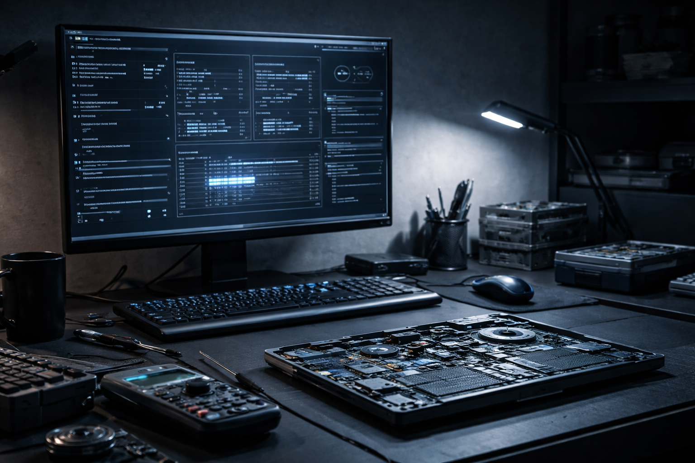

# Remeldo Stone — IT Support & Troubleshooting Portfolio

# Welcome to my portfolio repository.

This repo highlights practical, hands-on IT work with a focus on 
troubleshooting, structured diagnostics, and clear problem solving. 
It is designed to show how I approach real technical issues from 
first symptom to final resolution.

---

## About Me

I am an IT Technician and lead technician at Matrix Warehouse in 
Springs, Gauteng, where I handle hardware repairs, software 
troubleshooting, OS installations, and client-facing technical 
support on a daily basis.

I hold a Diploma in Network Systems (NQF Level 6) from Boston City 
Campus, completed in 2025 with a GPA of 3.8. My studies covered 
networking fundamentals, system administration, cloud technologies, 
and cybersecurity — aligned to industry certifications including 
CompTIA Network+, Security+, and Microsoft Azure.

Outside of work I maintain a homelab environment where I work with 
Windows Server, Active Directory, DNS, DHCP, Group Policy, and 
networking to build practical experience with enterprise-level 
technologies.

---

## What This Portfolio Shows

- Real-world troubleshooting mindset
- Clear and methodical diagnostic process
- Root cause analysis over symptomatic fixes
- Hardware and software support experience
- BIOS, storage, and Windows troubleshooting
- Understanding of hardware limitations and when to escalate
- Professional documentation of technical work

---

## Current Portfolio Section

### IT Troubleshooting

Path: `IT-Troubleshooting/`

This section contains documented troubleshooting write-ups based on 
real cases I have worked on as a practising IT Technician.

Current documented cases:

- [Packard Bell Laptop — Soldered NIC BIOS Fault](https://github.com/RemmyStone08/remeldo-portfolio/blob/main/IT-Troubleshooting/packard-bell-soldered-nic-bios-fault.md)
- [RAID to AHCI Conversion (Dell Inspiron 15)](https://github.com/RemmyStone08/remeldo-portfolio/blob/main/IT-Troubleshooting/dell-inspiron-15-raid-to-ahci.md)
- [100% Disk Usage Diagnosis (HP 15, Intel RST + SSD)](https://github.com/RemmyStone08/remeldo-portfolio/blob/main/IT-Troubleshooting/hp-15-100-disk-usage-rst-ssd.md)
- [Gaming PC — No Display After Case Transfer](https://github.com/RemmyStone08/remeldo-portfolio/blob/main/IT-Troubleshooting/gaming-pc-no-display-after-case-transfer.md)
- [MacBook 2012 — Dedicated GPU Failure](https://github.com/RemmyStone08/remeldo-portfolio/blob/main/IT-Troubleshooting/macbook-2012-dgpu-fix.md)

### IT Help Desk Ticketing Simulation

Path: `Ticketing-lab/`

A simulated IT help desk environment based on real-world repair 
ticket experience, demonstrating ticket lifecycle management from 
creation through to resolution and documentation.

---

## My Troubleshooting Approach

1. Identify the problem from the client report
2. Confirm and reproduce the symptoms
3. Test likely causes methodically
4. Eliminate what is not causing the issue
5. Determine the root cause
6. Apply or recommend the best solution
7. Document the outcome clearly

---

## Skills Demonstrated

- PC hardware troubleshooting and repair
- Windows diagnostics and recovery
- BIOS configuration and firmware level diagnosis
- Storage troubleshooting (RAID, AHCI, SSD behaviour)
- Network adapter diagnosis and driver management
- Performance analysis and root cause identification
- Client-facing communication and expectation management
- Technical documentation
- Ticket lifecycle management

---

## Current Focus

I am actively building experience and knowledge in:

- Infrastructure and data center operations
- System administration
- Networking fundamentals and advanced concepts
- Cloud technologies (Microsoft Azure)
- Blue Team cybersecurity

---

## Certifications in Progress

- CompTIA Network+
- Microsoft Azure Fundamentals (AZ-900)

---

This repository will continue to grow as I add more troubleshooting 
cases, homelab documentation, and technical write-ups.
